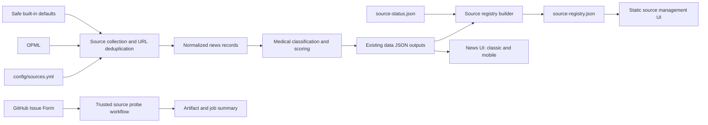

# Configurable Medical Source Management — Design

**Date:** 2026-07-18
**Status:** Approved
**Target branch:** `agent/medical-radar-source-management`
**Repository:** `xavier9802/medical-news-radar`

## 1. Purpose

Transform the existing medical-news fork into a configurable medical source system while preserving its GitHub-only deployment model and current collection pipeline. The implementation must remain runnable with only a repository, GitHub Actions, repository Secrets/Variables, JSON artifacts under `data/`, and GitHub Pages.

The change must not introduce a server-side application, database, login system, long-running service, client-side GitHub token, or mandatory LLM dependency.

## 2. Baseline and constraints

The target repository currently has:

- a single responsive frontend (`index.html`, `assets/app.js`, `assets/styles.css`);
- hard-coded source collections and source tiers in `scripts/update_news.py`;
- hard-coded medical relevance rules in `scripts/medical_relevance.py`;
- OPML ingestion alongside built-in feeds;
- scheduled updates every 30 minutes in `.github/workflows/update-news.yml`;
- JSON data products including `archive.json`, `latest-24h.json`, `latest-24h-all.json`, `source-status.json`, `daily-brief.json`, `stories-merged.json`, `merge-log.json`, and `title-zh-cache.json`;
- no `config/`, `personas/`, `classic/`, `?view=`, `?data=`, or Persona execution pipeline.

The existing test baseline is 43 passing tests. Python compilation and `node --check assets/app.js` also pass.

The live workflow is currently failing because the public demo OPML contains an unescaped ampersand in `FDA News & Events`. This design includes the minimal `&amp;` correction so scheduled updates can recover.

## 3. Selected approach

Use a compatibility-first extension of the current fork. Do not import or rebase onto a newer upstream architecture. Add the missing dual-view, configurable source, scoring, registry, probe, and Persona capabilities natively inside the current application.

This approach avoids replacing working medical-specific logic while still meeting the intended feature contract.

## 4. Architecture



The pipeline remains batch-oriented. Configuration is loaded at process startup, records are enriched during the existing normalization flow, and all user-facing state is emitted as static JSON.

## 5. Configuration model

Add the following files:

### `config/categories.yml`

Defines ordered medical categories, labels, descriptions, and enabled state.

Required category IDs:

| ID | Label |
| --- | --- |
| `policy` | 政策监管 |
| `medical_ai` | 医疗AI |
| `primary_care` | 基层医疗 |
| `insurance_compliance` | 医保合规 |
| `health_it` | 医疗信息化 |
| `pharma_device` | 医药器械 |
| `company_market` | 企业动态 |
| `global_healthtech` | 海外前沿 |

`all` and `hot` remain virtual frontend sections and are not stored as article categories.

### `config/keywords.yml`

Defines weighted keyword entries for strong medical signals, medium medical signals, the eight categories, policy documents, and noise. Each entry supports `term`, `weight`, `categories`, and `enabled`, including English terms.

### `config/scoring.yml`

Defines the required weights, thresholds, bonuses, and noise penalties. New public scores use a 0–1 scale. The existing `medical_score` remains on its current 0–1 scale for compatibility.

### `config/source-tiers.yml`

Defines `s`, `a`, `b`, and `c` tier IDs, labels, descriptions, and authority scores. Unknown tiers fall back to the lowest safe default rather than receiving an authoritative score.

### `config/sources.yml`

Each source uses the user-approved schema:

```yaml
sources:
  - id: who-news
    name: WHO News
    homepage_url: https://www.who.int/news-room
    feed_url: https://www.who.int/feeds/entity/cds/headlines/en/rss.xml
    type: rss
    category: global_healthtech
    tier: s
    language: en
    region: global
    enabled: true
    featured: true
    fetch:
      strategy: rss
      interval_hours: 1
      max_items: 30
      timeout_seconds: 20
    filters:
      include_keywords: []
      exclude_keywords: []
    metadata:
      source_origin: builtin
      added_by: system
      notes: WHO public news feed
```

Invalid entries are skipped individually and reported as warnings.

### Loader behavior

Add `scripts/config_loader.py` as the single YAML-loading boundary.

- Use `yaml.safe_load` only.
- Resolve default configuration relative to the repository, not the current working directory.
- Permit explicit paths in functions and CLIs for testing.
- Return validated defaults when a file is missing, unreadable, or structurally invalid.
- Preserve a clear parse error in loader diagnostics while allowing callers to fall back.
- Ignore invalid optional fields instead of failing the whole pipeline.
- Never log configuration values that could contain credentials.
- Cache stable configuration in normal execution, with a cache reset hook for tests.

Pin `PyYAML==6.0.2` in runtime requirements.

## 6. Source ingestion and deduplication

Migrate built-in public medical feeds into `config/sources.yml`. Keep the current Python lists as fallback defaults during the compatibility period.

Collection behavior:

1. Load enabled YAML sources.
2. Load OPML feeds when an OPML file is provided.
3. Normalize feed URLs by lower-casing scheme and host, removing default ports and fragments, and normalizing harmless trailing slashes.
4. Deduplicate YAML, OPML, and fallback feeds by normalized feed URL.
5. Prefer YAML metadata when the same URL appears in multiple inputs.
6. Preserve stable existing `site_id` behavior where downstream grouping relies on it, while attaching a new stable `source_id`.

Malformed optional configuration must not stop OPML or fallback feeds from being collected.

## 7. Medical enrichment contract

Extend `scripts/medical_relevance.py` with these public functions:

- `load_medical_config`
- `score_medical_relevance`
- `classify_medical_category`
- `calculate_importance_score`
- `detect_policy_signal`
- `detect_noise`

`score_medical_relevance` must continue returning the existing keys (`is_medical_related`, `score`, `label`, `reason`, `signals`, and `noise`) so current tests and callers remain valid. It may add structured explanation fields.

Enriched records may add:

```text
category
category_label
source_id
source_tier
source_authority_score
language
region
medical_relevance_score
impact_score
importance_score
is_official
is_policy
policy_metadata
topic_value
content_angles
persona_scores
```

All new article fields are optional for consumers. Existing JSON fields must not be renamed or removed.

### Category classification

Classification is deterministic and uses ordered category rules. Strong, specific signals take precedence over broad signals. Ties are resolved using configured category priority and source metadata. The result includes the winning category and matched evidence.

### Policy signals

`detect_policy_signal` returns a boolean plus structured metadata when available. Dates, document numbers, and authorities are only emitted when present in the source record. The system must not infer or fabricate legal facts.

### Noise detection

`detect_noise` returns matched noise groups, matched terms, and a configurable penalty. A strong medical signal can offset broad noise, but commercial or unrelated content without a meaningful medical signal is rejected.

### Importance score

Importance combines configurable relevance, impact, authority, and timeliness components, plus official, policy, and multi-source bonuses and noise penalties. The function returns both a 0–1 score and a component breakdown.

## 8. Persona mechanism

Add:

- `personas/medical-editor.md`
- `personas/policy-analyst.md`
- `personas/medical-ai-product-manager.md`
- `scripts/persona_score.py`

Each Persona document uses YAML front matter for stable ID, label, focus categories, and weighting hints, followed by editorial guidance and safety instructions.

The default Persona scorer is local and deterministic. It produces `persona_scores`, `topic_value`, and `content_angles` from verified record metadata and scoring explanations.

Optional DeepSeek enhancement is disabled unless explicitly configured and a Secret is available. If enabled, it sends only title, short summary, and structured metadata; validates structured output; applies a timeout; and falls back silently. No LLM call is required for collection, classification, registry generation, source probing, frontend rendering, or tests.

## 9. Source registry

Add `scripts/build_source_registry.py` with CLI options for source config, source status, archive, and output paths.

It combines configured source metadata with current status and, where available, the latest item timestamp found in the archive.

Status derivation:

| Status | Rule |
| --- | --- |
| `disabled` | Source configuration has `enabled: false`. |
| `failed` | The current source status explicitly has `ok: false`. |
| `warning` | The current check succeeded but produced zero items, or available item timestamps exceed the configured staleness threshold. |
| `healthy` | The current check succeeded and produced items without a stale-data warning. |
| `unknown` | No matching current status exists. |

Because `source-status.json` currently has no historical checks, `last_checked_at` uses its top-level `generated_at`, and `success_rate` remains `null`. `latest_item_at` is derived only when a matching archive record exists. Missing facts are represented as `null`, never invented.

The generated output is `data/source-registry.json`. A missing status file still produces an `unknown` registry.

## 10. Source management frontend

Add `sources.html`, `assets/sources.js`, and `assets/sources.css`.

The page fetches `data/source-registry.json` and provides keyword, category, tier, and status filters; count summaries; source badges; last checked and latest item timestamps; concise errors; website links; and a source-request Issue Form link. It contains no authentication, GitHub API mutation, or client-side token.

## 11. Main frontend compatibility

Replace the old category navigation with the eight medical categories while preserving all items, curated items, hot items, search, time ordering, and multi-source story folding.

Older records without `category` use a lightweight frontend fallback classifier aligned with the configured IDs. Backend-generated categories always take precedence. Cards add category, source tier, official-source, and policy badges without removing existing metadata.

### View modes

Implement modes inside the current SPA:

- default: responsive auto layout;
- `?view=classic`: force desktop information density and navigation arrangement;
- `?view=mobile`: force a single-column compact layout with touch-friendly controls.

### Data parameter

`?data=` may override the primary news JSON path for previews and compatibility tests. Accept only same-origin HTTP(S) URLs or safe relative paths. Reject URL credentials, non-HTTP schemes, path traversal, local file paths, and cross-origin locations. Invalid values fall back to production data.

## 12. Source request Issue Form

Add `.github/ISSUE_TEMPLATE/source-request.yml` with the ten requested fields, Chinese dropdown values, and optional `source-request` label. Workflow behavior must not depend on that label existing.

## 13. Safe source probe

Add `scripts/source_probe.py` with URL and config modes and JSON output. Separate pure feed analysis from network retrieval so tests never require real network access.

Network safety requirements:

- allow only HTTP and HTTPS;
- reject embedded credentials;
- reject localhost names and DNS results in loopback, private, link-local, multicast, unspecified, reserved, and other non-public address ranges for IPv4 and IPv6;
- validate every redirect target after fresh DNS resolution;
- limit redirects;
- apply separate connection and read timeouts;
- cap response bytes before parsing;
- use a fixed, transparent User-Agent;
- do not execute JavaScript, send cookies, bypass authentication, or fetch article full text;
- redact request exceptions before emitting reports.

## 14. Probe workflow

Add `.github/workflows/source-check.yml` for `workflow_dispatch` and Issue `opened`/`edited` events with `contents: read` and `issues: read` permissions.

Only issues whose `author_association` is `OWNER`, `MEMBER`, or `COLLABORATOR` automatically perform network probing. Other issues receive structural validation only. The workflow never edits configuration or commits changes.

## 15. Update workflow integration

Preserve the current `*/30 * * * *` schedule, `workflow_dispatch`, existing Secrets/Variables, and `git add data/` behavior. After news generation, run the source registry builder. Fix the public demo OPML XML escaping. No private OPML contents or secret values may be logged or committed.

## 16. Documentation

Update `README.md` and add `docs/source-management.md` plus `docs/source-schema.md`. Documentation states the actual 30-minute cron and distinguishes deterministic scoring from optional LLM enhancement.

## 17. Error handling

Missing or invalid YAML, malformed OPML, feed failures, missing status/archive/registry, missing Persona files, DeepSeek failures, and invalid query parameters all degrade gracefully. Errors remain observable without exposing secrets or terminating unrelated processing.

## 18. Testing and verification

Add `tests/test_config_loader.py`, extend `tests/test_medical_relevance.py`, and add `tests/test_source_registry.py` plus `tests/test_source_probe.py`. Tests cover YAML fallback, category classification, scoring, registry status mapping, SSRF protection, mocked feed analysis, Issue Form/workflow YAML, and query-parameter compatibility.

Final commands:

```bash
python -m pytest -q
python -m compileall scripts
node --check assets/app.js
node --check assets/sources.js
git diff --check
```

No unit test may depend on real network access.

## 19. Delivery sequence

Use small reviewable commits:

1. fix the demo OPML and add configuration loading;
2. add category, keyword, scoring, tier, and source configuration;
3. extend deterministic medical classification and scoring;
4. integrate configured sources and build the source registry;
5. add the safe source probe, Issue Form, and probe workflow;
6. add Persona documents and deterministic Persona scoring;
7. add the source management page and main frontend compatibility modes;
8. integrate Actions and update documentation;
9. complete regression, security, and generated-data verification.

The final remote deliverable is a Draft PR titled `feat: add configurable medical source management`.

## 20. Acceptance conditions

The implementation is complete when all user-specified acceptance criteria pass, all old and new tests remain green, no secret/private content is introduced, changes exist only on `agent/medical-radar-source-management`, and delivery occurs through a Draft PR.
