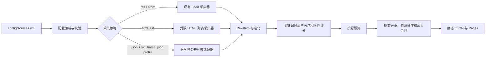

# 国内医疗信源与行业媒体接入设计

**日期：** 2026-07-19

**状态：** 书面方案已确认；已纳入实现前技术复核修订

**目标分支：** `feature/china-medical-sources`
**仓库：** `xavier9802/medical-news-radar`

## 1. 目标

在不改变 GitHub Actions 定时采集、静态 JSON 数据产物和 GitHub Pages 部署方式的前提下，新增一批可公开访问的国内医疗信源，重点覆盖：

- 医疗、医保和卫生政策；
- 社会办医、民营医院和诊所行业；
- 基层医疗、社区卫生和县域医疗；
- 医疗 AI、医院信息化和数据治理；
- 医院运营、医药器械和生物医药产业动态。

本次同时补齐 `html_list` 采集能力，并为一个公开、无需登录的医学界列表 JSON 接口增加受限适配器。所有新增来源均作为公开互联网信源运行，不需要 Secret、Cookie、账号、验证码或浏览器自动化。

## 2. 非目标与边界

本次不实现：

- 微信公众号、小红书、抖音或其他只能登录后访问的平台采集；
- 绕过 WAF、验证码、反爬策略、付费墙或地区限制；
- 文章正文抓取、图片下载或内容镜像；
- 医疗诊断、患者用药建议或病例数据库；
- 通用任意 JSON API 执行器、任意请求头或任意 HTTP 方法配置；
- 服务端数据库、常驻服务或必须调用大模型的处理链路。

采集器只读取列表级元数据：标题、原文链接、发布时间以及列表页已有的短摘要。政策事实不得从媒体文章中推断为官方结论。

## 3. 首批信源

保留现有国际和期刊信源，新增以下 9 个国内信源。

| ID | 信源 | 列表地址 | 类型 / 策略 | 分类 | 等级 | 单轮上限 |
| --- | --- | --- | --- | --- | --- | ---: |
| `cn-nhsa-policy` | 国家医保局政策法规 | `https://www.nhsa.gov.cn/col/col104/index.html` | `government_page` / `html_list` | `insurance_compliance` | S | 8 |
| `cn-chs-news` | 中国社区卫生协会 | `https://www.chs.org.cn/news/list/7/` | `static_page` / `html_list` | `primary_care` | A | 6 |
| `cn-cnmia-news` | 中国非公立医疗机构协会 | `https://www.cnmia.org/Web/Article/Dynamic.aspx` | `static_page` / `html_list` | `company_market` | A | 6 |
| `cn-chima-news` | CHIMA | `https://www.chima.org.cn/Html/News/Main/53.html` | `static_page` / `html_list` | `health_it` | A | 6 |
| `cn-kanyijie` | 看医界 | `https://www.kanyijie.com/` | `social_observation` / `html_list` | `company_market` | B | 5 |
| `cn-hospital-ceo` | 中国医院院长网 | `https://www.h-ceo.com/news.html` | `social_observation` / `html_list` | `company_market` | B | 5 |
| `cn-mdweekly` | 医师报 | `https://www.mdweekly.com.cn/` | `social_observation` / `html_list` | `primary_care` | B | 4 |
| `cn-yxj` | 医学界 | `https://pcapi.yxj.org.cn/ysz-content/web/home/news/getNewsModuleData` | `json` / `json`（profile: `yxj_home_json`） | `health_it` | C | 3 |
| `cn-bioon` | 生物谷 | `https://www.bioon.com/` | `social_observation` / `html_list` | `pharma_device` | C | 3 |

### 3.1 等级含义

- S 级是原始官方政策来源，作为政策事实和文件链接的首选。
- A 级是全国性行业协会或专业组织，用于补充行业通知和实践信息。
- B/C 级医疗媒体是“线索发现层”，用于发现案例、趋势和市场变化，不能替代官方依据。

同一事件出现多个来源时，现有的来源等级排序和故事合并机制继续优先保留 S、A 级来源。

### 3.2 已排除候选

以下来源不进入本次配置：

- 健康界：实际响应为阿里云 WAF JavaScript 挑战页；
- 诊锁界、赛柏蓝：在 GitHub Actions 出口网络中不可稳定访问；
- 中国社区医师网：探测结果显示登录或访问限制；
- 丁香园、医脉通、梅斯医学、动脉网、医药魔方：登录墙或反爬限制；
- 亿欧大健康：返回浏览器探测脚本而非列表内容；
- 医趋势：首页最新标题没有可靠的列表级发布日期，带日期区域超过新闻时效窗口；
- 基层医邦、HC3i：中国数字医疗网：主要列表长期停更。

不会为了提高数量而启用上述来源，也不会引入代理、Cookie 或无头浏览器绕过限制。

## 4. 总体数据流



采集失败继续沿用按源隔离：某个 HTML 结构变化或 JSON 接口失败，只把该源记入 `source-status.json`，不终止其他来源或整次日报生成。

## 5. 配置扩展

### 5.1 `fetch` 字段

扩展 `scripts/config_loader.py`，保留现有字段，并允许以下受控字段：

```yaml
fetch:
  strategy: html_list
  interval_hours: 3
  max_items: 5
  timeout_seconds: 20
  parser_profile: hospital_ceo
  allowed_hosts:
    - www.h-ceo.com
```

字段约束：

- `parser_profile` 必须是代码中登记的 profile ID；未知值使该来源跳过并产生可见配置错误。
- `allowed_hosts` 只能是非空公共域名列表，最终文章链接必须命中白名单。
- `max_items` 是该来源过滤后进入后续流程的输出上限；HTML 解析器最多扫描前 100 个候选节点，防止超大页面消耗失控。
- 不允许在 YAML 中配置任意请求头、Cookie、HTTP 方法、请求体、JavaScript 或重定向脚本。

### 5.2 HTML profile

新增 `HTML_LIST_PROFILES` 登记表。每个 profile 只描述静态 DOM 提取规则：

```text
item_selector
link_selector
title_selector 或 title_attribute
date_selector
summary_selector（可选）
link_pattern
date_formats
```

首批 profile：

```text
nhsa_policy
chs_news
cnmia_news
chima_news
kanyijie
hospital_ceo
mdweekly
bioon
```

profile 与来源 ID 分离，使 DOM 解析逻辑可以用离线 fixture 测试，同时避免把任意 CSS 选择器开放为不受约束的运行时输入。

### 5.3 医学界 JSON 适配器

医学界首页虽然是服务端渲染页面，但发布时间位于压缩后的 Nuxt 状态中，直接解析 JavaScript 脆弱且难以安全维护。其首页使用的公开接口会返回结构化的 `articleId`、`title`、`brief` 和 `publishTime`，因此使用专用适配器：

```yaml
fetch:
  strategy: json
  interval_hours: 3
  max_items: 3
  timeout_seconds: 20
  parser_profile: yxj_home_json
  allowed_hosts:
    - pcapi.yxj.org.cn
    - www.yxj.org.cn
```

```text
POST https://pcapi.yxj.org.cn/ysz-content/web/home/news/getNewsModuleData
body: {"categoryId": 0, "position": "HOME_PAGE_MAIN_NEWS"}
```

适配器必须固定：

- 唯一允许的主机、路径、HTTP 方法和请求体字段；
- `body.moduleList[].newsList[]` 为唯一读取路径；
- 文章链接模板为 `https://www.yxj.org.cn/detailPage?articleId=<integer>`；
- `publishTime` 只接受合理范围内的 Unix 秒时间戳；
- 响应体大小、超时和条目数上限。

该适配器不能被其他配置行复用为通用 JSON 请求器。

## 6. HTML 列表采集器

在 `scripts/update_news.py` 中增加独立的列表解析边界：

```text
parse_html_list_items(html, source, profile, now) -> list[RawItem]
fetch_html_list(session, source, profile, now) -> list[RawItem]
```

解析规则：

1. 使用固定透明 User-Agent，不发送 Cookie，不执行 JavaScript。
2. 只接受成功的 HTML 响应，并限制响应体大小。
3. 在每个 `item_selector` 容器内提取字段，避免标题、日期错配。
4. 相对链接根据列表地址解析；最终链接必须是 HTTP(S) 且命中 `allowed_hosts`。
5. `link_pattern` 不匹配的导航、专题、课程和广告链接直接丢弃。
6. 标题清理空白和不可见字符；过短标题丢弃。
7. 日期只按 profile 声明格式解析，统一为带时区时间；不得把采集时间伪装成发布日期。
8. 没有有效标题、链接或发布日期的条目不进入新闻流，并计入解析诊断。
9. 摘要只使用列表页已有文本并限制长度，不访问文章详情页。
10. URL、标题和来源 ID 形成稳定去重键；移除常见跟踪参数，但保留业务 ID 参数。

国家医保局页面中的静态 `<datastore>` 记录仍按 HTML 解析，不执行页面脚本。

## 7. 过滤、限流与内容安全

### 7.1 官方与协会来源

S/A 级来源允许空 `include_keywords`，交由现有医疗相关性规则分类；仍应用明显噪声排除和时间窗口检查。

### 7.2 医疗媒体来源

B/C 级媒体必须配置主题词和商业噪声排除词。首批主题范围：

- 社会办医、民营医院、诊所、医疗服务、医共体、县域医疗；
- 医保、支付方式、合规、监管；
- 医疗 AI、数字医疗、医院信息化、数据治理；
- 医院管理、运营、学科建设；
- 创新药、医疗器械、科研转化和产业政策。

公共排除范围：

```text
报名、早鸟票、招商、招聘、课程、培训班、会议通知、直播预告、广告
```

医学界和医师报额外过滤纯病例讨论、患者用药、疾病症状和单纯诊疗指南；生物谷优先保留创新药械、产业、审批、AI 和科研转化，降低纯基础机制论文的比例。

过滤顺序为：结构有效性 → 来源 include/exclude → 现有医疗相关性门槛 → 来源 `max_items`。任何来源都不能通过高发布量占满整期结果。

## 8. 权威性、去重与展示

- 新来源继续使用现有 `source_tier`、`source_authority_score` 和 `is_official` 字段。
- 只有 S 级政府来源设置 `is_official: true`；行业协会和媒体不得标记为官方政策来源。
- 同标题或同事件聚合时按来源等级、医疗相关性和时间排序，S/A 级优先成为主条目。
- 媒体转载政策时保留媒体原文链接，但不得生成虚假的文件号、发布机构、生效日期或适用范围。
- 来源管理页展示等级和健康状态，使用户能区分原始政策、行业组织和媒体观察。

## 9. 错误处理与可观测性

每个新增来源在 `source-status.json` 中记录：

```text
source_id
source_name
feed_url
ok
item_count
duration_ms
error
```

错误信息使用稳定类别，不写响应正文：

```text
unsupported_parser_profile
request_failed
response_too_large
unexpected_content_type
no_valid_items
invalid_json_shape
invalid_item_url
invalid_publish_time
```

同一来源零条有效结果以 `no_valid_items` 记为失败，不把页面标题、导航项等错误地当作新闻来维持“健康”状态。已有有效条目但全部超过陈旧阈值时，继续由来源注册表标记为 warning。其他来源照常采集、分类和生成数据。

## 10. 安全约束

- 所有地址来自受版本控制的 `config/sources.yml`，并经过公开 HTTP(S) URL 校验。
- HTML 文章链接限制在 profile 的域名白名单内；生物谷允许 `www.bioon.com` 与 `news.bioon.com`。
- 重定向后的最终列表 URL 必须再次满足预期主机约束。
- 不记录 Cookie、Authorization、查询密钥或响应正文。
- 不新增 GitHub Secret，不向前端暴露凭据。
- 不使用 Jina、代理服务、浏览器指纹伪装或验证码服务。

## 11. 测试设计

### 11.1 离线 fixture

为 8 个 HTML profile 各保存一个最小、脱敏的 HTML fixture，只保留足以证明 DOM 结构的 1 至 3 条虚构内容。fixture 不复制完整网页或文章正文。

测试覆盖：

- 标题、日期、摘要和相对链接解析；
- 每个 profile 的文章路径过滤；
- 域名白名单和跨域链接拒绝；
- 缺字段、坏日期、空列表和 DOM 结构变化；
- 响应体大小和内容类型限制；
- 单源 `max_items`；
- HTML 文本中的登录按钮不会自动等同于文章需要登录。

### 11.2 JSON 适配器

使用离线 JSON fixture 测试医学界字段映射、Unix 时间戳、整数文章 ID、响应结构异常和条目上限。测试不得访问真实网络。

### 11.3 集成与回归

- `configured_feed_groups` 保留新 parser 字段和允许主机；
- 现有 RSS、Atom 和 Crossref JSON 行为不变；
- 一个新增来源失败时，其他来源仍返回结果和独立状态；
- B/C 级过滤和上限生效；
- 合并后的同事件优先选择 S/A 级来源；
- 来源注册表能展示 9 个新增来源及状态。

最终验证命令：

```powershell
.\.venv\Scripts\python.exe -m pytest -q
.\.venv\Scripts\python.exe -m compileall scripts
node --check assets/app.js
node --check assets/sources.js
git diff --check
```

单元测试不依赖外网。网络可达性只通过手动 source-check 和功能分支上的 GitHub Actions 验证。

## 12. 文档与配置更新

同步更新：

- `config/sources.yml`：新增 9 个来源；
- `docs/source-schema.md` 与 `docs/CONFIG_REFERENCE.md`：记录 profile、允许主机和专用 JSON 策略；
- `docs/SOURCE_COVERAGE.md`：列出国内政策、基层、社会办医、AI、医院管理和医药器械覆盖；
- `README.md`：说明 HTML 来源是列表级采集，媒体来源是线索层；
- 项目技能文档：如需更新，只补充与实际实现一致的维护命令和安全边界。

## 13. 发布与回滚

实施完成后：

1. 在功能分支运行全部离线验证；
2. 推送分支并创建 Draft PR；
3. 在 PR 分支运行 source-check 或更新工作流，确认新增来源状态；
4. 检查生成 JSON 中的数量、日期、分类、来源等级和重复事件；
5. 合并后观察首次定时任务和 Pages 来源管理页。

回滚只需禁用单个配置行，或回退新增采集器提交；现有 RSS/Atom 和 Crossref 路径保持独立，不受影响。

## 14. 验收标准

实现满足以下条件才算完成：

1. 9 个新增来源均存在于配置，等级、分类和单轮上限符合本设计。
2. 8 个 HTML profile 和医学界 JSON 适配器均有离线 fixture 测试。
3. 不执行 JavaScript、不发送 Cookie、不抓取详情页、不绕过访问限制。
4. 媒体来源经过主题过滤、商业噪声排除和按源限流。
5. 无效日期不被替换为采集时间，政策元数据不被推断或编造。
6. 单源失败不影响其他来源和整次数据生成。
7. 同一事件优先展示更高等级来源，媒体不能冒充官方来源。
8. 全量测试、Python 编译、前端语法检查和 `git diff --check` 全部通过。
9. GitHub Actions 真实运行成功，新增来源状态和生成数据经过人工抽样。
10. 通过 Draft PR 交付，不直接向 `main` 推送。

## 15. 实现前技术复核记录

书面方案确认后，为满足“列表级采集必须提供真实发布日期”的既定约束，做出两项不改变产品目标的技术修订：

1. 中国社区卫生协会从无日期的聚合首页切换到带发布日期的分支机构列表页；
2. 医趋势替换为医师报。医趋势最新焦点区没有列表级发布日期，不能用图片文件名或采集时间推断；医师报公开首页包含近期标题、文章链接和明确日期，并已通过 GitHub Actions 可达性检查。
